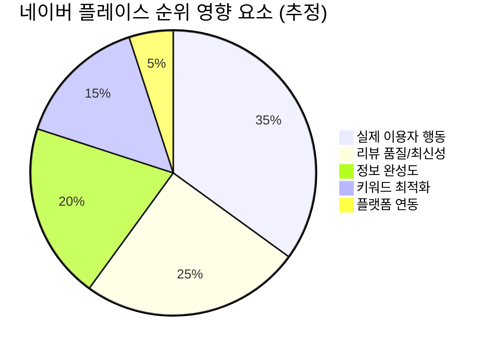
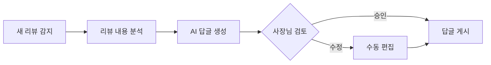
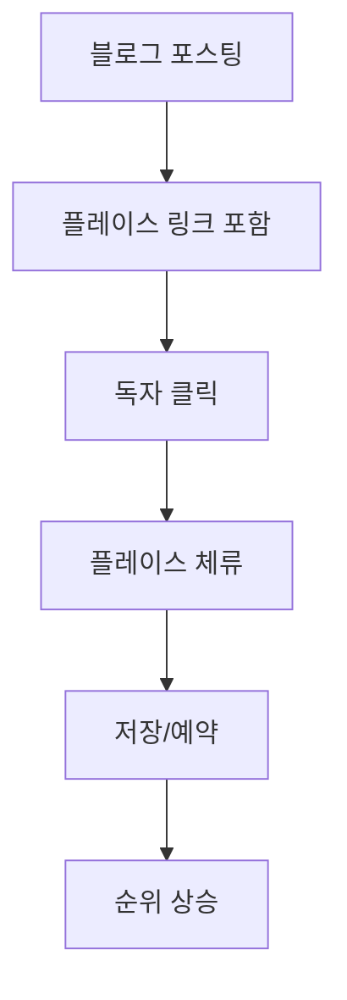
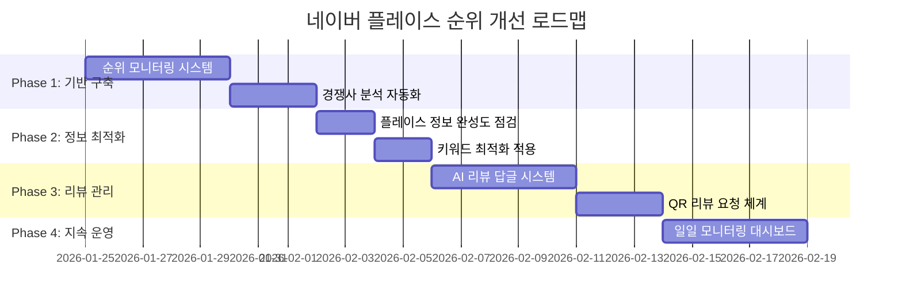

# 네이버 플레이스 순위 최적화 전략

> 규림한의원 청주점을 위한 AI 기반 종합 전략 리포트

---

## 1. 핵심 요약

네이버 플레이스 순위 알고리즘은 **2025년부터 '실제 이용자 행동 데이터'를 핵심 지표로 강화**하였습니다. 단순히 리뷰 수나 저장 수를 늘리는 것만으로는 상위 노출이 어려워졌으며, **고객의 진정성 있는 상호작용**이 중요해졌습니다.

### 현재 marketing_bot 보유 기능

| 모듈 | 기능 | 네이버 플레이스 관련성 |
|------|------|----------------------|
| `scraper_naver_place.py` | 순위 확인, 경쟁사 리뷰 수집 | ⭐⭐⭐ 직접 관련 |
| `pathfinder.py` | 키워드 발굴 (Legion Mode) | ⭐⭐ 키워드 최적화 지원 |
| `cafe_spy.py` | 네이버 카페 잠재고객 발굴 | ⭐⭐ 간접 지원 |
| `scraper_competitor.py` | 경쟁사 분석 | ⭐⭐ 벤치마킹 |

---

## 2. 네이버 플레이스 랭킹 핵심 요소 (2025년 기준)



### 2.1 실제 이용자 행동 데이터 (가장 중요!)

| 지표 | 설명 | 영향도 |
|------|------|--------|
| **검색 후 클릭률 (CTR)** | 검색 결과에서 우리 가게를 클릭하는 비율 | 🔴 매우 높음 |
| **페이지 체류 시간** | 플레이스 페이지에서 머무는 시간 | 🔴 매우 높음 |
| **상호작용** | 메뉴 보기, 전화 클릭, 길찾기, 예약 등 | 🔴 매우 높음 |
| **저장 후 방문율** | 저장 → 실제 방문 전환율 | 🟠 높음 |
| **재방문 패턴** | 재방문 고객 비율 | 🟠 높음 |
| **톡톡 응답률** | 고객 문의 응대 속도 | 🟡 중간 |

### 2.2 리뷰 관리

| 지표 | 설명 | 영향도 |
|------|------|--------|
| **최근 30일 리뷰** | 최신 리뷰에 가중치 부여 | 🔴 매우 높음 |
| **영수증 리뷰** | 실제 방문 증명 리뷰 | 🔴 매우 높음 |
| **사진 포함 리뷰** | 사진이 있는 리뷰 우대 | 🟠 높음 |
| **리뷰 답글** | 사장님 답글의 성의도 | 🟡 중간 |

> [!CAUTION]
> **어뷰징 주의**: 가짜 리뷰, 급격한 리뷰 증가, 반복 문구 리뷰는 순위 하락 및 제재 대상

### 2.3 정보 완성도

- 정확한 영업시간, 주소, 연락처
- 고품질 대표 사진 (3장 이상)
- 메뉴/가격 정보 상세 기입
- 주기적 정보 업데이트 (월 1회 이상)

### 2.4 키워드 최적화

- **상호명**: 핵심 키워드 포함 (예: "규림한의원 청주점")
- **소개글**: 첫 50자에 핵심 키워드 배치
- **태그**: 지역 + 업종 + 특화 서비스
- **세부 키워드**: "청주 다이어트 한의원", "청주 체형교정" 등

---

## 3. AI 및 도구를 활용한 전략 제안

### 3.1 🔍 순위 모니터링 시스템 (신규 개발 필요)

**목표**: 매일 특정 키워드에 대한 플레이스 순위 추적

```
┌─────────────────────────────────────────────────────────┐
│  Naver Place Rank Tracker                               │
├─────────────────────────────────────────────────────────┤
│  키워드: "청주 한의원"                                   │
│  ┌─────┬─────┬─────┬─────┬─────┬─────┬─────┐           │
│  │ Mon │ Tue │ Wed │ Thu │ Fri │ Sat │ Sun │           │
│  │  5  │  4  │  4  │  3  │  3  │  3  │  2  │ ← 순위    │
│  └─────┴─────┴─────┴─────┴─────┴─────┴─────┘           │
│  📈 주간 순위: 5위 → 2위 (3단계 상승)                    │
└─────────────────────────────────────────────────────────┘
```

**구현 방안**:
- 기존 `scraper_naver_place.py`의 `check_naver_place_rank()` 기능 확장
- 스케줄러 연동하여 매일 자동 실행
- 대시보드에 순위 트렌드 그래프 추가

---

### 3.2 📝 AI 리뷰 답글 어시스턴트 (신규 개발 필요)

**목표**: 새 리뷰 감지 → AI 답글 초안 생성 → 사장님 검토 후 게시



**AI 프롬프트 전략**:
```
역할: 규림한의원 청주점 원장님 대신 리뷰 답글 작성
톤앤매너: 따뜻하고 전문적, 과하지 않게 홍보
포함 요소:
- 감사 인사
- 리뷰 내용에 대한 구체적 공감
- 다음 방문 유도 (부드럽게)
- 한의원 특화 서비스 언급 (자연스럽게)
```

---

### 3.3 🎯 키워드 최적화 도우미 (기존 Pathfinder 연계)

**목표**: 플레이스 태그/소개글에 최적화된 키워드 추천

**활용 방안**:
1. Pathfinder의 키워드 데이터 활용
2. 높은 검색량 + 낮은 경쟁의 키워드 선별
3. 플레이스 태그/소개글 최적화 제안

**추천 키워드 예시** (Pathfinder 데이터 기반):
| 키워드 | 월간 검색량 | 경쟁도 | 추천도 |
|--------|------------|--------|--------|
| 청주 다이어트 한의원 | 2,400 | 낮음 | ⭐⭐⭐ |
| 청주 체형교정 | 1,200 | 중간 | ⭐⭐ |
| 청주 비만치료 | 880 | 높음 | ⭐ |

---

### 3.4 📊 경쟁사 벤치마킹 (기존 기능 강화)

**목표**: 상위 경쟁사의 성공 요인 분석

**수집 데이터**:
- 경쟁사 리뷰 수, 평점, 최근 리뷰 빈도
- 경쟁사 태그/키워드
- 경쟁사 사진 품질/수량
- 경쟁사 네이버 연동 서비스 (예약, 톡톡 등)

**AI 분석**:
```
[경쟁사 분석 리포트]
1위: OO한의원
- 강점: 영수증 리뷰 50%, 사진 품질 우수
- 약점: 리뷰 답글 없음
- 배울 점: 치료 전후 사진 활용

우리 대비 차이점:
- 리뷰 수: -12개 (개선 필요)
- 평점: +0.1 (우위)
- 사진: -5장 (개선 필요)
```

---

### 3.5 📱 고객 행동 유도 전략

> 네이버 알고리즘이 가장 중시하는 "실제 이용자 행동"을 자연스럽게 유도

#### A) 블로그/SNS 연계 전략


#### B) QR 리뷰 요청 시스템
- 내원 환자에게 리뷰 작성 QR 코드 제공
- 영수증 리뷰 작성 유도 (가장 신뢰도 높음)
- **주의**: 급격한 증가 패턴 피하기 (주 2-3개 목표)

#### C) 네이버 예약/톡톡 활용
- 네이버 예약 기능 활성화 → 예약 건수 = 순위 가점
- 톡톡 응답률 90% 이상 유지

---

## 4. 종합 실행 로드맵



---

## 5. 주의사항

> [!WARNING]
> ### 어뷰징 금지 사항
> - ❌ 가짜 리뷰 생성 (AI 자동 생성 포함)
> - ❌ 클릭/조회수 인위적 조작
> - ❌ 급격한 저장/리뷰 증가
> - ❌ 반복적인 문구의 리뷰
> - ❌ 타 플랫폼에서의 스팸성 유입

> [!IMPORTANT]
> ### 지속 가능한 전략의 핵심
> 네이버는 **진짜 고객이 진짜로 찾는 가게**를 상위 노출시키려 합니다.
> AI와 자동화 도구는 **실제 서비스 품질을 더 잘 전달**하는 데 사용해야 합니다.

---

## 6. 다음 단계

1. **우선순위 결정**: 위 전략 중 먼저 구현할 기능 선택
2. **순위 모니터링 시스템**: 현재 순위 baseline 파악
3. **키워드 최적화**: Pathfinder 데이터 기반 추천 키워드 적용
4. **리뷰 관리 시스템**: AI 답글 어시스턴트 개발

어떤 기능부터 구현해볼까요?
