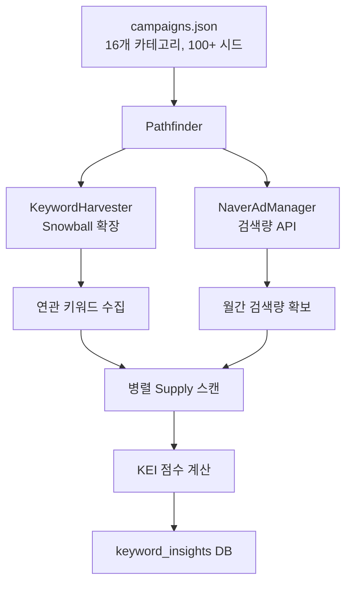
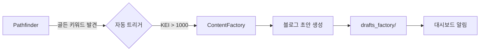
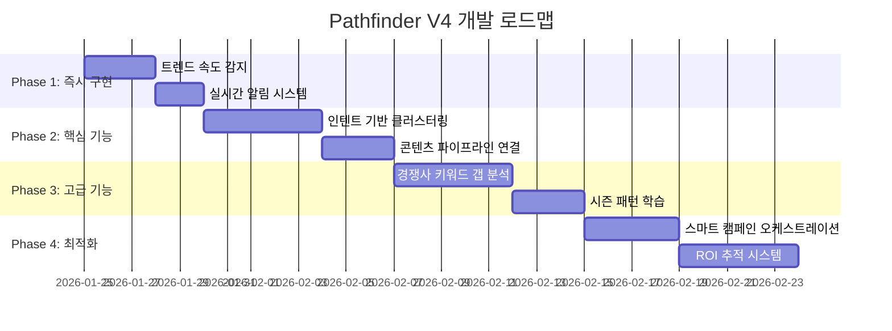

# Pathfinder 고도화 제안서

> Pathfinder V4: "The Oracle" - 예측형 키워드 인텔리전스 시스템

---

## 1. 현재 시스템 분석

### 1.1 핵심 아키텍처



### 1.2 현재 기능 요약

| 기능 | 설명 | 상태 |
|------|------|------|
| **Legion Mode** | 10만 키워드 무한 확장 | ✅ 구현됨 |
| **KEI 점수** | (검색량²)/공급량 | ✅ 구현됨 |
| **멀티리전** | 청주+세종+진천+증평+괴산+보은 | ✅ 구현됨 |
| **병렬 스캔** | ThreadPoolExecutor 30 workers | ✅ 구현됨 |
| **다양성 시드** | 고/중/저 볼륨 계층 선정 | ✅ 구현됨 |
| **동적 Intent** | 6가지 검색 페르소나 | ✅ 구현됨 |

### 1.3 현재 한계점

| 한계 | 설명 |
|------|------|
| 🔴 **단방향 수집** | 키워드만 수집, 콘텐츠 생성으로 연결 안 됨 |
| 🔴 **시간 개념 부재** | 트렌드 상승/하락 감지 불가 |
| 🔴 **경쟁사 연계 없음** | 경쟁사가 어떤 키워드 사용하는지 모름 |
| 🟡 **인텐트 분류 없음** | 정보/구매/비교 의도 미구분 |
| 🟡 **계절성 미반영** | 시즌 키워드 자동 가중치 없음 |

---

## 2. 고도화 제안

### 2.1 🧠 인텐트 기반 클러스터링 (Intent-Based Clustering)

**문제**: 모든 키워드가 동일하게 취급됨

**솔루션**: AI로 키워드를 구매 의도별 분류

```
┌─────────────────────────────────────────────────────────┐
│ 키워드: "청주 다이어트 한의원"                          │
│                                                         │
│ AI 분류 결과:                                           │
│ ├── 인텐트: 🛒 구매형 (Transactional)                   │
│ ├── 구매 단계: 비교/결정 단계                           │
│ ├── 우선순위: ⭐⭐⭐ (매우 높음)                         │
│ └── 추천 액션: 상세 후기 콘텐츠                         │
├─────────────────────────────────────────────────────────┤
│ 키워드: "다이어트 한약 부작용"                          │
│                                                         │
│ AI 분류 결과:                                           │
│ ├── 인텐트: ℹ️ 정보형 (Informational)                   │
│ ├── 구매 단계: 초기 탐색                                │
│ ├── 우선순위: ⭐⭐ (중간)                               │
│ └── 추천 액션: FAQ형 정보 콘텐츠                        │
└─────────────────────────────────────────────────────────┘
```

**구현 방법**:
```python
def classify_intent(self, keyword):
    """AI를 활용한 키워드 인텐트 분류"""
    prompt = f"""
    다음 키워드의 검색 의도를 분류하세요:
    키워드: {keyword}
    
    분류:
    1. TRANSACTIONAL (구매/예약/방문 의도)
    2. INFORMATIONAL (정보 탐색)
    3. NAVIGATIONAL (특정 장소/브랜드 찾기)
    4. COMMERCIAL (비교/리뷰 탐색)
    
    JSON 형식으로 답변: {{"intent": "...", "stage": "...", "priority": 1-5}}
    """
    return self.crew.researcher.generate(prompt)
```

**예상 효과**: 고전환 키워드 우선 공략 → 콘텐츠 ROI ↑

---

### 2.2 📈 트렌드 속도 감지 (Trend Velocity Detection)

**문제**: 급상승 키워드를 놓침

**솔루션**: 주기적 스캔으로 검색량 변화율 추적

```
┌─────────────────────────────────────────────────────────┐
│ 트렌드 알림 🔥                                          │
├─────────────────────────────────────────────────────────┤
│ "청주 GLP-1 다이어트"                                   │
│ ├── 1주 전 검색량: 120                                  │
│ ├── 현재 검색량: 890                                    │
│ ├── 변화율: +641% 🚀                                    │
│ └── 상태: 🔥 급상승 (선점 필요!)                        │
├─────────────────────────────────────────────────────────┤
│ "청주 쿨스컬프팅"                                       │
│ ├── 1주 전: 450 → 현재: 380                             │
│ ├── 변화율: -15%                                        │
│ └── 상태: 📉 하락세                                     │
└─────────────────────────────────────────────────────────┘
```

**구현 방법**:
```python
def detect_trend_velocity(self):
    """주간 검색량 변화율 계산"""
    # 1. 지난주 snapshot과 비교
    # 2. 변화율 = (현재 - 과거) / 과거 * 100
    # 3. 급상승 (>50%) 키워드 알림
    pass
```

**데이터 구조 변경**:
```sql
ALTER TABLE keyword_insights ADD COLUMN prev_search_volume INTEGER;
ALTER TABLE keyword_insights ADD COLUMN velocity_pct REAL;
ALTER TABLE keyword_insights ADD COLUMN last_updated TIMESTAMP;
```

---

### 2.3 🔗 콘텐츠 파이프라인 연결 (Content Pipeline Integration)

**문제**: 골든 키워드 발견해도 자동 액션 없음

**솔루션**: Pathfinder → ContentFactory 자동 연결



**구현 방법**:
```python
def auto_generate_content(self, golden_keywords):
    """골든 키워드 자동 콘텐츠 생성"""
    from content_factory import ContentFactory
    factory = ContentFactory()
    
    for kw in golden_keywords[:5]:  # 상위 5개만
        # 해당 키워드로 맞춤 콘텐츠 생성
        factory.generate_for_keyword(
            keyword=kw['keyword'],
            intent=kw.get('intent', 'informational'),
            zone=self._detect_zone(kw['keyword'])
        )
```

---

### 2.4 🎯 경쟁사 키워드 갭 분석 (Competitive Gap Analysis)

**문제**: 경쟁사가 어떤 키워드로 상위 노출되는지 모름

**솔루션**: 경쟁사 블로그/플레이스 분석 → 갭 키워드 발견

```
┌─────────────────────────────────────────────────────────┐
│ 경쟁사 키워드 갭 분석                                   │
├─────────────────────────────────────────────────────────┤
│ 경쟁사 A (OO한의원)가 상위 노출되는 키워드:             │
│ ├── "청주 위염 한의원" (우리: 없음 ❌)                   │
│ ├── "청주 만성피로" (우리: 15위 🟡)                     │
│ └── "청주 체형교정 비용" (우리: 없음 ❌)                │
│                                                         │
│ 💡 추천: 위 키워드 우선 콘텐츠 작성                     │
└─────────────────────────────────────────────────────────┘
```

**구현 방법**:
```python
def find_competitive_gaps(self, competitor_ids):
    """경쟁사 대비 우리가 놓치고 있는 키워드 발견"""
    # 1. 경쟁사 블로그 최근 포스팅 분석
    # 2. 해당 키워드에서 우리 순위 확인
    # 3. 순위 없거나 낮으면 = GAP
    pass
```

---

### 2.5 📅 시즌 패턴 학습 (Seasonal Pattern Learning)

**문제**: 계절성 키워드 수동 관리

**솔루션**: 과거 데이터 기반 시즌 패턴 자동 학습

```
┌─────────────────────────────────────────────────────────┐
│ 시즌 키워드 자동 가중치                                 │
├─────────────────────────────────────────────────────────┤
│ 1월 (현재):                                             │
│ ├── "신년 다이어트" × 2.5 가중치                        │
│ ├── "새해 목표" × 2.0 가중치                            │
│ └── "겨울 면역력" × 1.5 가중치                          │
│                                                         │
│ 📊 Prophet 연동: 다음 주 날씨 기반 동적 가중치          │
│     ├── 기온 급상승 예상 → "봄 다이어트" 가중치 ↑       │
│     └── 미세먼지 나쁨 예상 → "비염 치료" 가중치 ↑       │
└─────────────────────────────────────────────────────────┘
```

**구현 방법**:
```python
def apply_seasonal_weights(self, keywords):
    """시즌/날씨 기반 가중치 적용"""
    from prophet import TheProphet
    prophet = TheProphet()
    weather_impact = prophet._get_weather_impact()
    
    for kw in keywords:
        base_score = kw['opp_score']
        # 시즌 보정
        if self._is_seasonal_match(kw['keyword']):
            kw['opp_score'] = base_score * 1.5
```

---

### 2.6 🎛️ 스마트 캠페인 오케스트레이션 (Smart Campaign Orchestration)

**문제**: 모든 카테고리 동일 비중 처리

**솔루션**: 성과 기반 동적 시드 가중치

```
┌─────────────────────────────────────────────────────────┐
│ 캠페인 성과 기반 자동 조정                              │
├─────────────────────────────────────────────────────────┤
│ 카테고리 | 발견 키워드 | 골든키 | 콘텐츠 | 전환율 | 가중치│
│ ─────────────────────────────────────────────────────── │
│ 다이어트 │   3,200    │   45   │   12   │  3.2% │ ×2.0 │
│ 교통사고 │   1,800    │   28   │    8   │  2.8% │ ×1.5 │
│ 여드름   │   2,100    │   12   │    4   │  1.2% │ ×0.8 │
│ ─────────────────────────────────────────────────────── │
│ 💡 다이어트/교통사고 시드 확장, 여드름은 유지           │
└─────────────────────────────────────────────────────────┘
```

---

### 2.7 🔔 실시간 알림 시스템 (Real-Time Alert System)

**문제**: 기회 발견해도 즉시 알림 없음

**솔루션**: 골든 키워드 발견 시 즉시 알림

```python
def send_golden_alert(self, keyword_data):
    """골든 키워드 발견 시 알림"""
    # Slack/Discord/카카오톡 웹훅
    message = f"""
    🏆 골든 키워드 발견!
    
    키워드: {keyword_data['keyword']}
    검색량: {keyword_data['search_volume']:,}
    경쟁도: {keyword_data['competition']}
    기회점수: {keyword_data['opp_score']:.1f}
    
    추천 액션: 즉시 블로그 작성
    """
    self._send_webhook(message)
```

---

### 2.8 📊 ROI 추적 시스템 (ROI Tracking)

**문제**: 어떤 키워드가 실제 전환으로 이어지는지 모름

**솔루션**: 키워드 → 콘텐츠 → 순위 → 유입 → 전환 추적

```
┌─────────────────────────────────────────────────────────┐
│ 키워드 ROI 대시보드                                     │
├─────────────────────────────────────────────────────────┤
│ 키워드           │ 콘텐츠 │ 순위 │ 유입 │ 예약 │  ROI   │
│ ──────────────────────────────────────────────────────  │
│ 청주 다이어트    │   3    │  2위 │ 450  │  12  │ ⭐⭐⭐ │
│ 청주 체형교정    │   2    │  5위 │ 120  │   3  │ ⭐⭐   │
│ 청주 비만클리닉  │   1    │ 12위 │  45  │   0  │ ⭐     │
│ ──────────────────────────────────────────────────────  │
│ 인사이트: "다이어트" 계열 키워드 ROI 최고               │
│ 권장: 해당 계열 시드 가중치 상향                        │
└─────────────────────────────────────────────────────────┘
```

---

## 3. 우선순위 및 로드맵



| 순위 | 기능 | 복잡도 | ROI | 추천 이유 |
|------|------|--------|-----|----------|
| 1 | 트렌드 속도 감지 | 🟢 낮음 | ⭐⭐⭐ | 급상승 키워드 선점 |
| 2 | 콘텐츠 파이프라인 | 🟢 낮음 | ⭐⭐⭐ | 발견 → 액션 자동화 |
| 3 | 실시간 알림 | 🟢 낮음 | ⭐⭐ | 즉각 대응 가능 |
| 4 | 인텐트 클러스터링 | 🟡 중간 | ⭐⭐⭐ | 고전환 키워드 우선 |
| 5 | 경쟁사 갭 분석 | 🟡 중간 | ⭐⭐ | 경쟁 우위 확보 |
| 6 | 시즌 패턴 학습 | 🟡 중간 | ⭐⭐ | 예측형 마케팅 |
| 7 | 스마트 오케스트레이션 | 🟠 높음 | ⭐⭐ | 자원 최적화 |
| 8 | ROI 추적 | 🟠 높음 | ⭐⭐⭐ | 장기 최적화 |

---

## 4. 요약

**Pathfinder V4 "The Oracle" 핵심 방향:**

1. **수집 → 예측**: 단순 수집에서 트렌드 예측으로
2. **발견 → 액션**: 키워드 발견 → 콘텐츠 자동 생성
3. **개별 → 연결**: 경쟁사/시즌/ROI와 연계
4. **수동 → 자동**: 알림/가중치/우선순위 자동화

**가장 먼저 구현 추천:**
1. 트렌드 속도 감지 (3일)
2. 콘텐츠 파이프라인 연결 (3일)

이 두 기능만으로도 "골든 키워드 발견 → 즉시 콘텐츠 생성" 자동화 달성!

---

어떤 기능부터 구현해볼까요?
